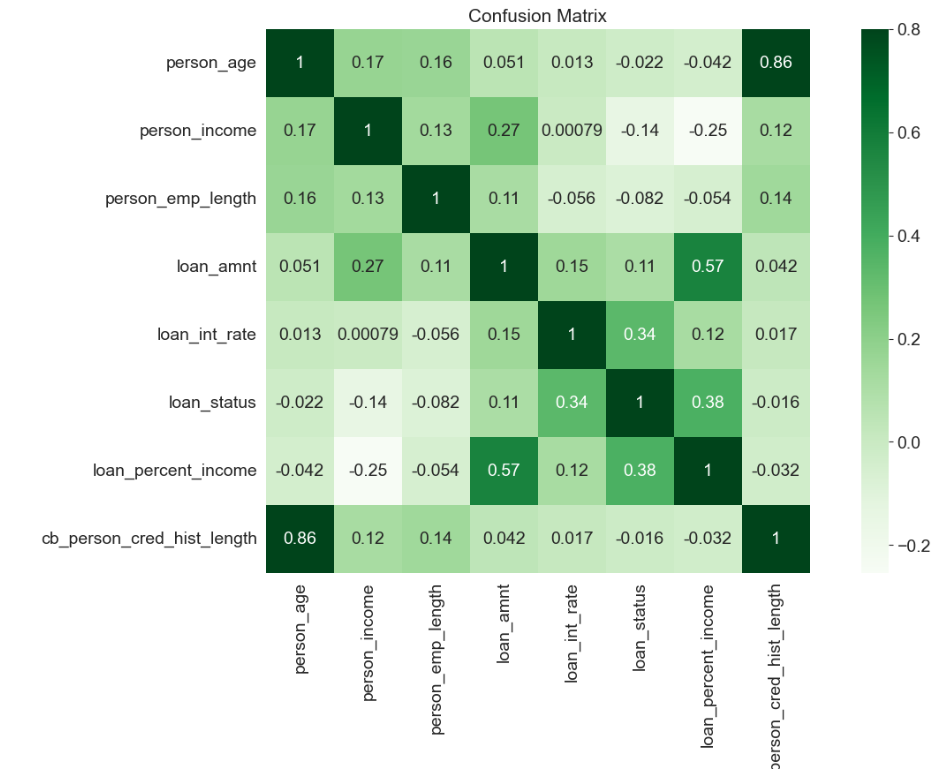
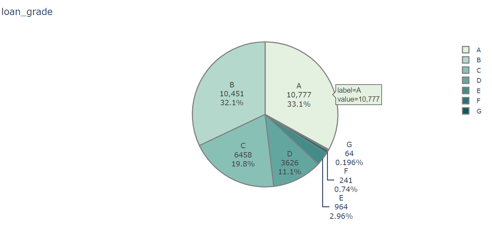
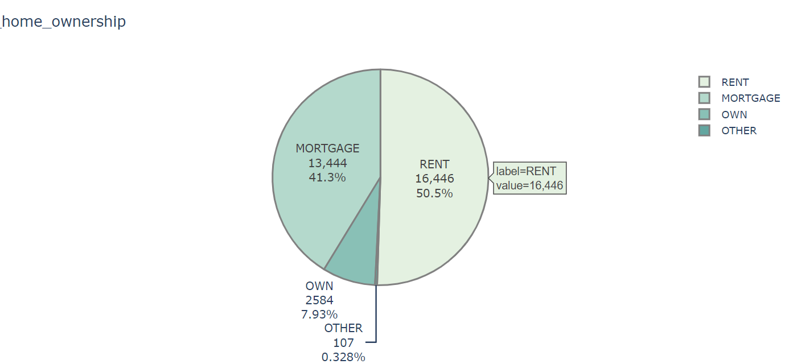
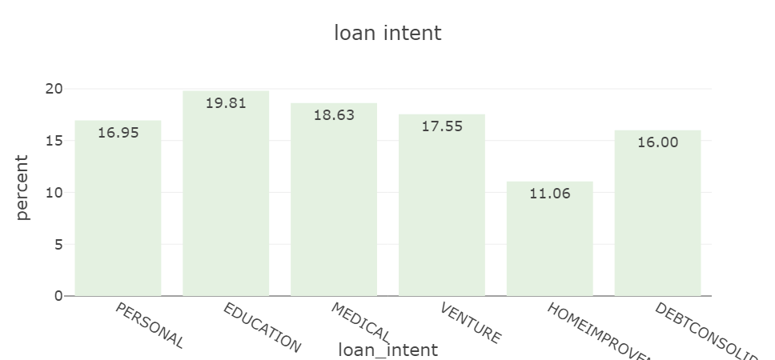
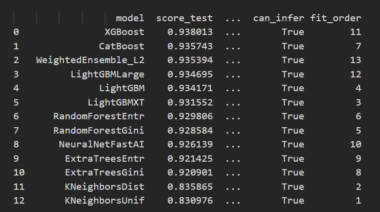

## 🌍 🔥 **Testez l'application en direct !** 🔥 🌍  

🔗 **[CLIQUEZ ICI POUR ESSAYER L'APPLICATION](https://credit-risk-forecasting-tool-ogqsechcb4bggnkcieflat.streamlit.app/)**  

---

## 📌 Description
Ce projet est une application de prédiction du risque de crédit permettant d’évaluer si un prêt est **accordé ou refusé** en fonction du profil de l’emprunteur.  
L’application utilise un modèle **XGBoost** entraîné sur un dataset de prêts et est déployée avec **Streamlit**.

### 📊 Caractéristiques principales :
✔️ **Modèle XGBoost** pour une classification binaire du risque de défaut.  
✔️ **Encodage OneHot** des variables catégorielles pour un traitement efficace.  
✔️ **Normalisation** des variables numériques avec StandardScaler.  
✔️ **Interface interactive** avec Streamlit pour tester différents profils emprunteurs.  
✔️ **Prise en charge de nouvelles observations** sans nécessiter de réentraînement du modèle.  


## 🎯 Utilisation

### 1️⃣ Lancer l'application Streamlit
#### Une interface s’ouvre dans le navigateur permettant de tester différents profils emprunteurs.
#### L'application utilise le modèle le plus adapté parmi une quinzaine de modèle

#### Elle donne snsuite un avis sur le risque de défaut de l'emprunteur et accorde le prêt 💸 ou non ❌

#### Une partie qui affiche l'importance de chaque parametre permet à l'utilisateur de savoir sur quoi jouer pour faire basculer la décision en sa faveur 

## 🏗 Structure du projet
```bash
Credit-Risk-forecasting-tool/
│── data/                       # Dossier contenant le dataset d'entraînement
│── models/                     # Dossier contenant les fichiers modèles sauvegardés
│   ├── xgboost_credit_risk.pkl  # Modèle XGBoost entraîné
│   ├── onehot_encoder.pkl       # OneHotEncoder sauvegardé
│   ├── scaler.pkl               # StandardScaler sauvegardé
│── images/                      # Dossier contenant les images du projet
│── streamlit_app.py             # Code de l'application Streamlit
│── train_model                  # Script pour entraîner le modèle
│   ├── train_model.py           # format py
│   ├── train_model.ipynb        # format jupyther notebook
│── save_models.ipynb            # Script pour sauvegarder le meilleur modèle
│── requirements.txt             # Dépendances nécessaires
│── README.md                    # Présentation du projet
```

le code qui m'a permi de traiter les données et comparer tous les modèles de ML est [ici](train_model/train_model.ipynb)

les données sont disponibles [ici](data/credit_risk_dataset.csv)


---

## 🔬 Détails techniques

### 📌 Modèle de Machine Learning
- `XGBoostClassifier` pour une classification binaire (`1` = défaut, `0` = remboursement réussi).
- **Hyperparamètres :**
  - `max_depth=6`
  - `learning_rate=0.1`
  - `n_estimators=100`
  - `eval_metric='logloss'`

### 📌 Préprocessing
- **Visualisation des données** avec **Seaborn**





- **Encodage** des variables catégorielles avec **OneHotEncoder**
```bash
from sklearn.preprocessing import OneHotEncoder
import numpy as np
import pandas as pd

# Création de l'encodeur OneHotEncoder
ohe = OneHotEncoder()

# Apprentissage des catégories uniques pour chaque colonne catégorielle dans x_train
ohe.fit(x_train[ohe_colums])

# Affichage des catégories apprises par l'encodeur pour chaque colonne catégorielle
ohe.categories_

# Fusion des catégories de toutes les colonnes encodées en un seul tableau numpy
# Cela permet d'obtenir toutes les valeurs uniques transformées en colonnes après One-Hot Encoding
merge_ohe_col = np.concatenate((
    ohe.categories_[0],  # Catégories uniques de la première colonne
    ohe.categories_[1],  # Catégories uniques de la deuxième colonne
    ohe.categories_[2],  # Catégories uniques de la troisième colonne
    ohe.categories_[3],  # Catégories uniques de la quatrième colonne
    ohe.categories_[4],  # Catégories uniques de la cinquième colonne
    ohe.categories_[5],  # Catégories uniques de la sixième colonne
    ohe.categories_[6]   # Catégories uniques de la septième colonne
))
# Affichage des noms de colonnes après encodage
merge_ohe_col  

# Transformation des données d'entraînement en one-hot encoding et conversion en DataFrame
ohe_data = pd.DataFrame(
    ohe.transform(x_train[ohe_colums]).toarray(),  # Transformation en tableau numpy
    columns=merge_ohe_col  # Attribution des colonnes selon les catégories fusionnées
)

# Transformation des données de test en one-hot encoding et conversion en DataFrame
ohe_data2 = pd.DataFrame(
    ohe.transform(x_test[ohe_colums]).toarray(),  # Transformation en tableau numpy
    columns=merge_ohe_col  # Attribution des colonnes selon les catégories fusionnées
)

```

- **Normalisation** des variables numériques avec **StandardScaler**
```bash
scaler_normal = StandardScaler()
X_new.loc[:,normal_col] = scaler_normal.fit_transform(X_new.loc[:,normal_col])
X_new_test.loc[:,normal_col] = scaler_normal.transform(X_new_test.loc[:,normal_col])

```

- **Création de nouvelles features**
```bash
# crée ratio loan-to-income
data['loan_to_income_ratio'] = data['loan_amnt'] / data['person_income']

# crée ratio loan-to-employment length
data['loan_to_emp_length_ratio'] =  data['person_emp_length']/ data['loan_amnt'] 

# crée ratio interest rate-to-loan amount 
data['int_rate_to_loan_amt_ratio'] = data['loan_int_rate'] / data['loan_amnt']

```
- **Sauvegarde la pipeline complète (préprocessing + modèle) et classement des modèle testés**  avec **PyCaret et AutoGluon**



1️⃣ Meilleur score test (0.9380) : Il surpasse les autres modèles en termes de précision.
2️⃣ Fit Order élevé (11) : Cela signifie qu'il a été entraîné dans les étapes avancées de l'AutoML, ce qui montre qu'AutoGluon l'a identifié comme performant et a affiné ses hyperparamètres.
3️⃣ Gagne face à CatBoost et LightGBM : Même si CatBoost et LightGBM sont très performants, XGBoost a une meilleure généralisation sur les données de test.

--- 


## 📞 Contact

👤 **Auteur** : Grégoire
📧 **Email** : sarsat.gregoire@gmail.com  
🌍 **LinkedIn** : [mon profil Linkedin](https://www.linkedin.com/in/gregoire-sarsat/)

🌟 **Si tu trouves ce projet utile, n’hésite pas à laisser une ⭐ sur GitHub !** 🚀🎉

