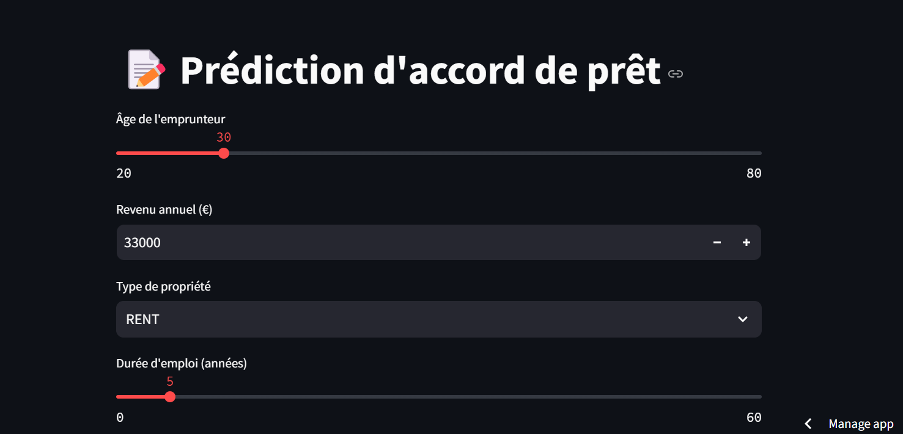
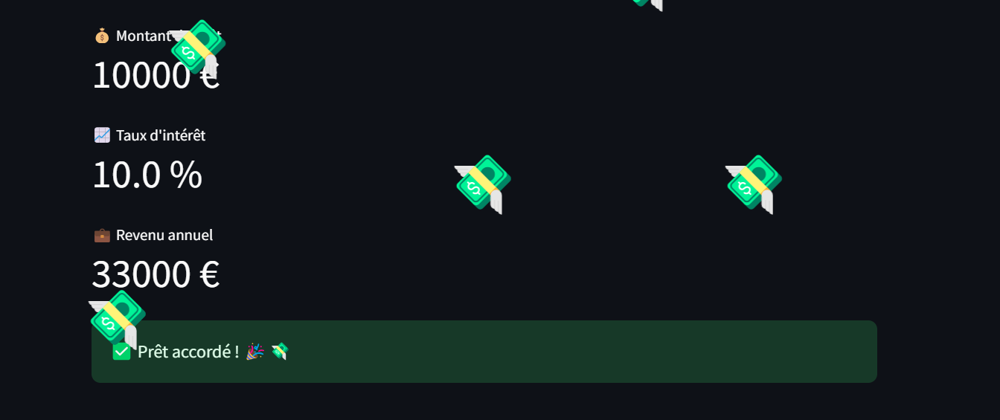
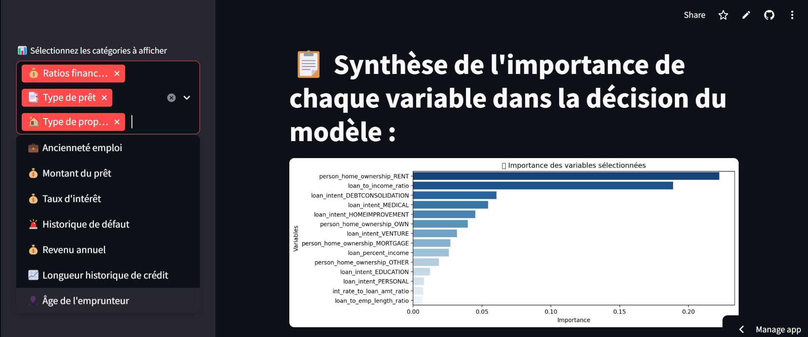

# 🚀 Credit Risk Forecasting Tool



## 🌍 🔥 **Testez l'application en direct !** 🔥 🌍  

🔗 **[CLIQUEZ ICI POUR ESSAYER L'APPLICATION](https://credit-risk-forecasting-tool-ogqsechcb4bggnkcieflat.streamlit.app/)**  

---

## 📌 Description
Ce projet est une application de prédiction du risque de crédit permettant d’évaluer si un prêt est **accordé ou refusé** en fonction du profil de l’emprunteur.  
L’application utilise un modèle **XGBoost** entraîné sur un dataset de prêts et est déployée avec **Streamlit**.

### 📊 Caractéristiques principales :
✔️ **Modèle XGBoost** pour une classification binaire du risque de défaut.  
✔️ **Encodage OneHot** des variables catégorielles pour un traitement efficace.  
✔️ **Normalisation** des variables numériques avec StandardScaler.  
✔️ **Interface interactive** avec Streamlit pour tester différents profils emprunteurs.  
✔️ **Prise en charge de nouvelles observations** sans nécessiter de réentraînement du modèle.  


## 🎯 Utilisation

### 1️⃣ Lancer l'application Streamlit
#### Une interface s’ouvre dans le navigateur permettant de tester différents profils emprunteurs.
#### L'application utilise le modèle le plus adapté parmi une quinzaine de modèle

#### Elle donne snsuite un avis sur le risque de défaut de l'emprunteur et accorde le prêt 💸 ou non ❌

#### Une partie qui affiche l'importance de chaque parametre permet à l'utilisateur de savoir sur quoi jouer pour faire basculer la décision en sa faveur 

## 🏗 Structure du projet
```bash
Credit-Risk-forecasting-tool/
│── data/                       # Dossier contenant le dataset d'entraînement
│── models/                     # Dossier contenant les fichiers modèles sauvegardés
│   ├── xgboost_credit_risk.pkl  # Modèle XGBoost entraîné
│   ├── onehot_encoder.pkl       # OneHotEncoder sauvegardé
│   ├── scaler.pkl               # StandardScaler sauvegardé
│── images/                      # Dossier contenant les images du projet
│── streamlit_app.py             # Code de l'application Streamlit
│── train_model                  # Script pour entraîner le modèle
│   ├── train_model.py           # format py
│   ├── train_model.ipynb        # format jupyther notebook
│── save_models.ipynb            # Script pour sauvegarder le meilleur modèle
│── requirements.txt             # Dépendances nécessaires
│── README.md                    # Présentation du projet
```

---

## 🔬 Détails techniques

### 📌 Modèle de Machine Learning
- `XGBoostClassifier` pour une classification binaire (`1` = défaut, `0` = remboursement réussi).
- **Hyperparamètres :**
  - `max_depth=6`
  - `learning_rate=0.1`
  - `n_estimators=100`
  - `eval_metric='logloss'`

### 📌 Préprocessing
- **Encodage** des variables catégorielles avec **OneHotEncoder**  
- **Normalisation** des variables numériques avec **StandardScaler**  
- **Création de nouvelles features** (ratios de risque comme `loan_to_income_ratio`).  

---

## ✅ Améliorations futures
🔹 Ajout d’une **API Flask/FastAPI** pour déployer le modèle en backend.  
🔹 Optimisation des **hyperparamètres** avec GridSearchCV.  
🔹 Ajout de **nouvelles variables explicatives** pour affiner la prédiction.  
🔹 Déploiement sur **Streamlit Cloud** pour accès en ligne.  

---

## 🤝 Contribuer

Les contributions sont les bienvenues !  

💡 Pour contribuer :  
1. **Fork** le projet 🍴  
2. Crée une branche (`git checkout -b feature-amélioration`)  
3. Ajoute tes modifications  
4. **Commit** (`git commit -m "Ajout d'une nouvelle feature"`)  
5. **Push** (`git push origin feature-amélioration`)  
6. Ouvre une **Pull Request** sur GitHub 🎉  

---

## 📄 Licence
Ce projet est sous licence **MIT**.  
Tu es libre de l'utiliser, le modifier et le redistribuer avec attribution.

---

## 📞 Contact

👤 **Auteur** : Grégoire
📧 **Email** : sarsat.gregoire@gmail.com  
🌍 **LinkedIn** : [mon profil Linkedin](https://www.linkedin.com/in/gregoire-sarsat/))  

🌟 **Si tu trouves ce projet utile, n’hésite pas à laisser une ⭐ sur GitHub !** 🚀🎉

